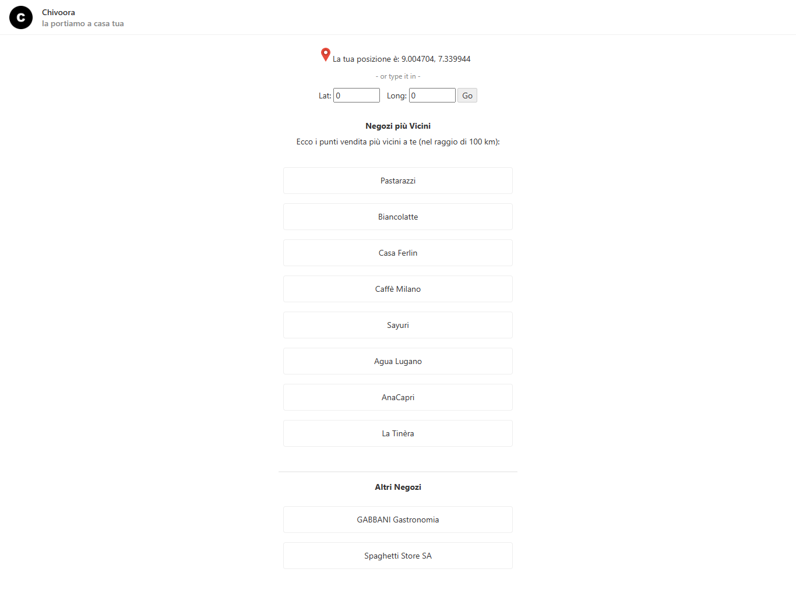
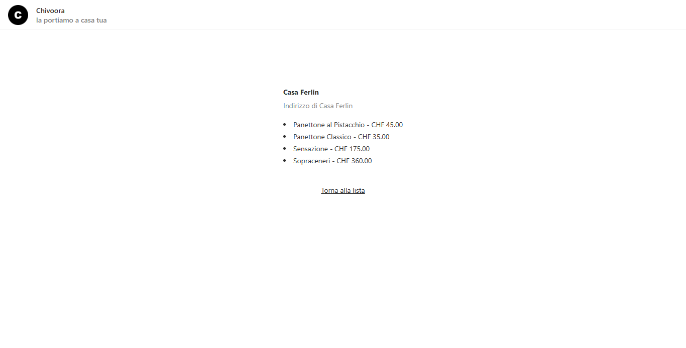

# Divoora Full-Stack FollowUp Assignment

This is **Chivoora**, my submission for the assignment given to me at Divoora for the role of Full-Stack engineer. View the live version here: https://chivoora.web.app/

## To run

- Clone with `git clone https://github.com/Chizaram-Igolo/chivoora.git`
- `cd` into folder
- Install all dependencies with `npm install`
- Start application with `ng serve --open` or `ng serve` and navigate to `localhost:4200` in your browser.

## Screenshots

## List View

## Details View

## Product Specification

A Web application that:

- Geolocates the user.
- Gets the stores list based on user location.
- Allows user to click on store item to display more details about the store.

### User Stories

As derived from the requirements given in the assignment.

- As a user, I want my location to be discovered so that I can view the nearest stores to my location.
- As a user, I want to click on a store in the list so that I can view more details about a store.

## Skills I demonstrated

- Filtering and retrieval of data relevant to geographical location (based on distance).
- Proficiency with Angular
- Static type-checking with TypeScript.

## Stack

- Angular (with TypeScript)  

Thank you for your time and consideration.
